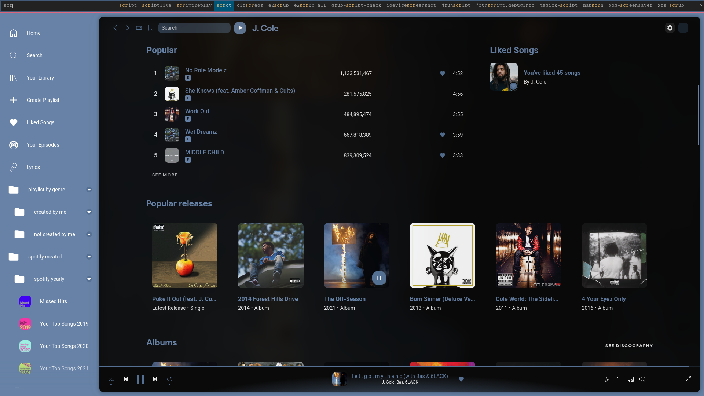

# dotfiles
## My Arch Linux dotfiles :)
### Repository contains configs for the following programs:
- [awesome](https://awesomewm.org/)
- bash
- [fish](https://github.com/fish-shell/fish-shell)
- [alacritty](https://github.com/alacritty/alacritty)
- [termite](https://github.com/thestinger/termite/)
- [picom](https://github.com/yshui/picom)
- [polybar](https://github.com/polybar/polybar)
- [spicetify-cli](https://github.com/khanhas/spicetify-cli)
- [starship](https://github.com/starship/starship)
### configs for my specific setup
- [OpenRGB](https://github.com/CalcProgrammer1/OpenRGB)

## Screenshots

## Dependencies
### Polybar
- Custom icon font (not available for download, may need to replace icons in config)
### Spicetify-cli
- [Dribbblish theme](https://github.com/morpheusthewhite/spicetify-themes/tree/master/Dribbblish)

## Installation
The first option is to just use the install script I made, which basically moves the files in their respective directories and backs up any conflicting files in the process.
To execute the script just use the following command:

``curl -Ls https://raw.githubusercontent.com/manos00/dotfiles/master/github/dotfiles/install.sh | bash``

To install manually follow these steps:
- Run the following command to clone this repository as a bare repository:

``mkdir -p $HOME/github/dotfiles/ && git clone --bare https://github.com/manos00/dotfiles $HOME/github/dotfiles``
- Add the following alias to your shell config (e.g. .bashrc or .zsh):

``alias config='/bin/env git --git-dir=$HOME/github/dotfiles/ --work-tree=$HOME'``
- To use the alias you will have to either reload your shell or define it in the current shell scope (That meaning "just type out the line mentioned above in the command line and hit enter")
- cd into your ``$HOME`` directory and type ``config checkout``
